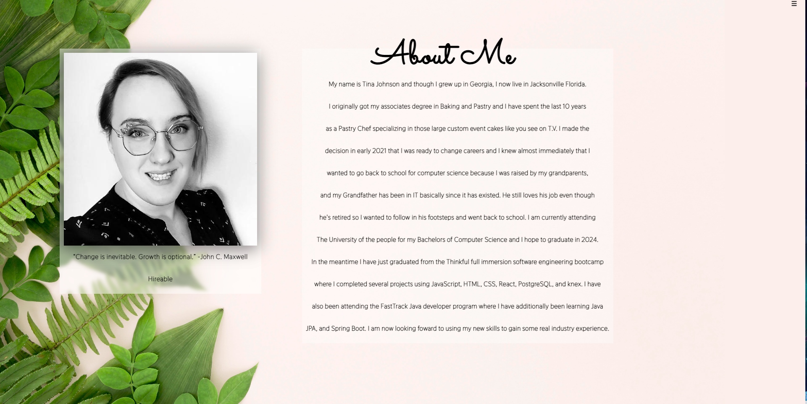
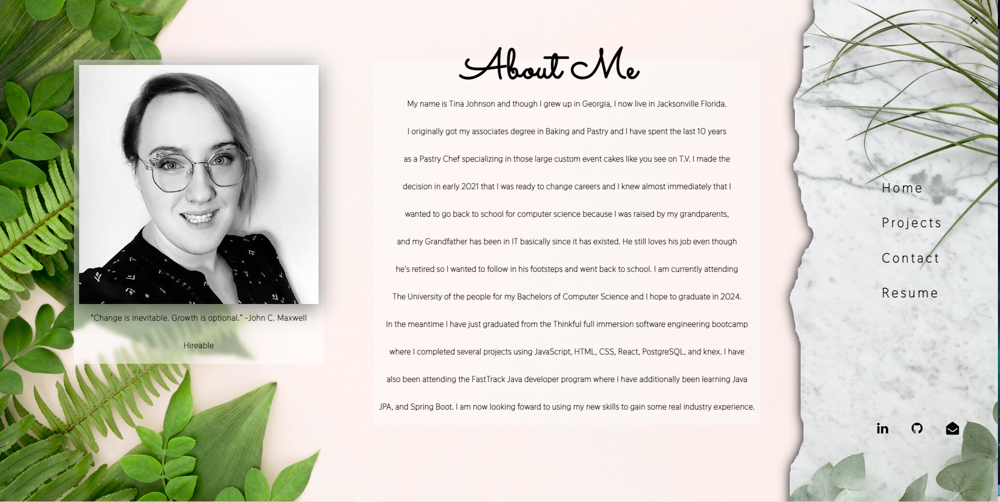
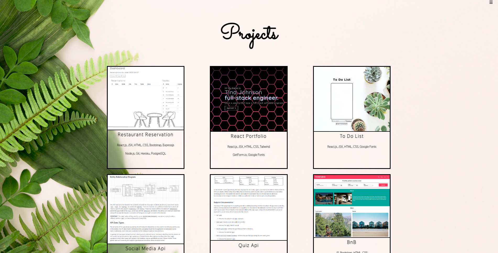
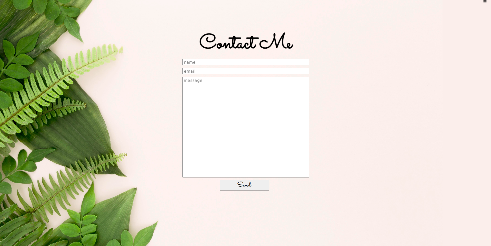

# Fast Track Portolio
A simple portfolio webpage.

Project Prompt:

## Technology

- HTML, CSS, JS, Git, Vercel, GetForm.io, and Google Fonts

## Links

[Deployed Version](https://fast-track-portfolio.vercel.app/)

## Screenshots 
### Home:

The Homepage has the following features:

- A video background.
- A Button to navigate to the About page.
- A Button to navigate to the Projects page.
- A Button to navigate to the Contace Page.

### About Page:

- My picture, bio, and hireable status pulled from GitHub's api.
- Information about me and my experience.
- A secret message hidden behind my picture that is revealed on hover.

### Side Nav:

- Clicking the hamburger icon on the top right corner reveals the dynamic side navigation.
- Side navigation allows user to navigate to each page and Resume link when clicked will download by resume.
- Bottom icons will open tabs to my LinkedIn, GitHub, and Email.

### Projects Page:

- The projects page displays cards that show the picture and information of the projects I have worked on.
- Clicking the titles of the projects will open a tab to either the GitHub repo or the deployed version of the projects.

### Contact Page:

- The contact page has a form where you can send a message to me via GetForm.io

